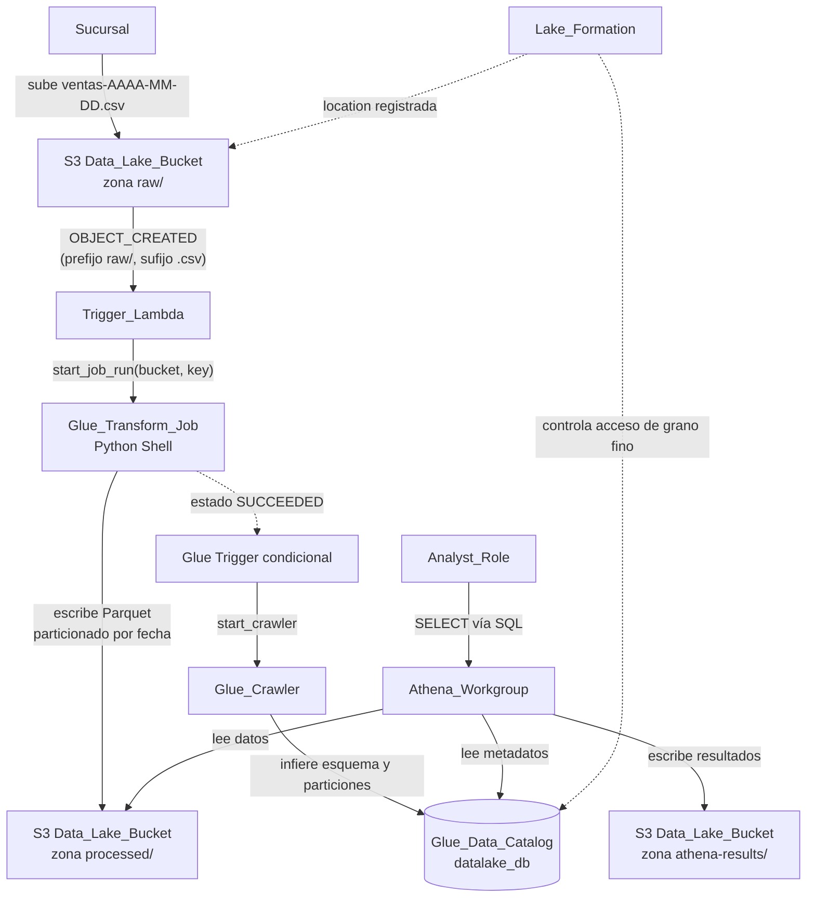
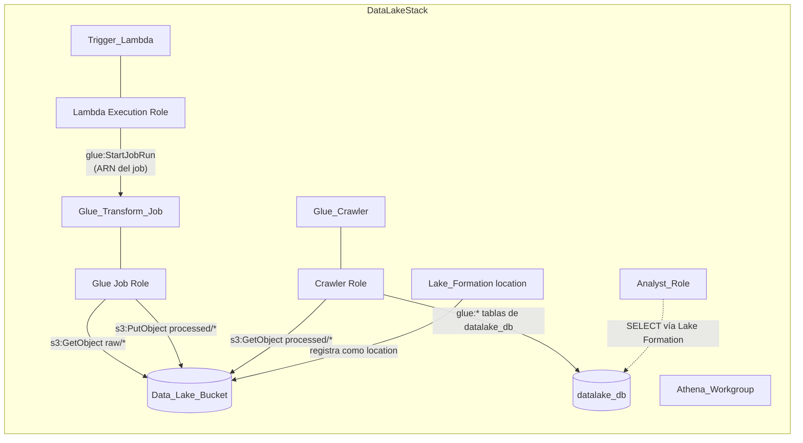

# Documento de Diseño

## Overview

**serverless-datalake-aws** es un Data Lake serverless educativo definido íntegramente con AWS CDK
v2 (Python) dentro de un único stack, `DataLakeStack`. Este documento traduce los 11 requisitos del
`requirements.md` en un diseño técnico concreto: arquitectura, componentes, modelos de datos,
propiedades de corrección, manejo de errores y estrategia de pruebas.

El sistema implementa una arquitectura **event-driven y desacoplada** donde cada servicio hace una
sola cosa y se comunica con los demás mediante eventos y convenciones de ubicación en el bucket:

1. **El almacenamiento notifica**: al crear un CSV en `raw/`, S3 emite una notificación filtrada.
2. **Una función orquesta**: `Trigger_Lambda` recibe el evento e inicia el Glue Job.
3. **Un job transforma**: `Glue_Transform_Job` convierte el CSV a Parquet particionado por fecha
   en `processed/`.
4. **Un crawler cataloga**: al terminar el job con éxito, `Glue_Crawler` registra/actualiza las
   tablas en `datalake_db`.
5. **Un motor de consultas expone**: `Athena_Workgroup` permite consultar por SQL con protección
   de costos, y `Lake_Formation` controla el acceso de grano fino.

Ningún componente conoce los detalles internos del otro. El acoplamiento es por **convención de
prefijos** (`raw/`, `processed/`, `curated/`, `athena-results/`) y por **eventos** (notificación
S3, finalización del Glue Job).

### Decisiones de diseño clave

| Decisión | Elección | Justificación |
|----------|----------|---------------|
| Tipo de Glue Job | **Python Shell** (no Spark) | Ver "Decisión: tipo de Glue Job". Archivos pequeños y diarios; prioriza claridad y costo bajo. |
| Disparo del crawler | **Glue Trigger condicional** (job SUCCEEDED → crawler) | Nativo, sin Lambda extra, mantiene la estructura de archivos del steering. Ver "Decisión: disparo del crawler". |
| Filtro de notificación S3 | Prefijo `raw/` + sufijo `.csv` | Evita loops infinitos: las escrituras en `processed/` no re-disparan el pipeline. |
| Acceso a datos del analista | Solo vía Lake Formation (sin IAM directo a S3) | Demuestra el patrón de permisos de grano fino del catálogo. |

## Architecture

### Diagrama de flujo de datos



### Diagrama de componentes y permisos



### Modelo event-driven

El pipeline no tiene orquestador central. El flujo se compone de tres saltos de evento
independientes y desacoplados:

1. **S3 → Lambda**: notificación `OBJECT_CREATED` filtrada por prefijo `raw/` y sufijo `.csv`. Este
   filtro es **crítico** para evitar loops: el Glue Job escribe en `processed/`, que no coincide con
   el filtro, de modo que esas escrituras nunca re-invocan la Lambda.
2. **Lambda → Glue Job**: invocación explícita vía `start_job_run`, pasando `bucket` y `key` como
   argumentos del job.
3. **Glue Job → Crawler**: al terminar el job con estado `SUCCEEDED`, un Glue Trigger condicional
   inicia el crawler. La catalogación ocurre sin intervención manual.

### Parametrización de cuenta y región

`app.py` resuelve cuenta y región y las pasa al stack vía `env` de CDK. No hay valores literales en
`datalake_stack.py`. Orden de resolución de la región:

1. `CDK_DEFAULT_REGION` / `CDK_DEFAULT_ACCOUNT` (inyectadas por la CLI de CDK desde el perfil AWS).
2. Variable de entorno propia `DATALAKE_REGION` o contexto de CDK `-c region=...` como región por
   defecto configurable.
3. Si no se puede determinar cuenta o región, `app.py` aborta la síntesis con un mensaje que indica
   cuál de los dos valores falta (Requisito 11.3).

## Components and Interfaces

### Organización del stack (`datalake/datalake_stack.py`)

Para mantener la legibilidad (objetivo educativo), el constructor de `DataLakeStack` crea los
recursos en **orden de dependencia**, con cada bloque precedido por un comentario en español que
explica el porqué. El orden es:

1. **Data_Lake_Bucket** — base de todo; el resto depende de él.
2. **IAM Roles** — roles de Lambda, Glue Job y Crawler (se crean antes que los recursos que los usan
   para poder referenciar sus ARNs).
3. **Glue_Data_Catalog (datalake_db)** — base de datos del catálogo.
4. **Glue_Transform_Job** — referencia el script de `glue_src/` como asset y su rol.
5. **Trigger_Lambda** — referencia el código de `lambda_src/`, su rol, y se le concede permiso de
   iniciar el job por ARN.
6. **Notificación S3 → Lambda** — filtrada por prefijo `raw/` y sufijo `.csv`.
7. **Glue_Crawler + Glue Trigger condicional** — target `processed/`, salida `datalake_db`.
8. **Athena_Workgroup** — resultados en `athena-results/`, límite de bytes.
9. **Lake_Formation** — location del bucket + Analyst_Role + permiso `SELECT`.
10. **Outputs** — exactamente cuatro.

Las dependencias que CDK no infiere automáticamente (p. ej. location de Lake Formation respecto del
bucket) se declaran de forma explícita con `add_dependency`. Cada sección se podría extraer a un
método privado (`_create_bucket`, `_create_roles`, etc.) para mantener el `__init__` legible.

### 1. Data_Lake_Bucket (S3)

`aws_cdk.aws_s3.Bucket` con:

- `encryption=BucketEncryption.S3_MANAGED` (SSE-S3, Requisito 1.2/1.3).
- `block_public_access=BlockPublicAccess.BLOCK_ALL` (activa las cuatro opciones, Requisito 1.4/1.5).
- `versioned=True` (Requisito 1.6).
- `removal_policy=RemovalPolicy.DESTROY` y `auto_delete_objects=True` (Requisito 1.7/1.8).
- `enforce_ssl=True` (buena práctica adicional, niega tráfico no-TLS).

Las zonas son **prefijos lógicos**, no recursos: `raw/`, `processed/`, `curated/` y
`athena-results/`. No requieren creación explícita; se materializan al escribir objetos.

### 2. Trigger_Lambda (`lambda_src/trigger_pipeline.py`)

`aws_cdk.aws_lambda.Function`:

- `runtime=Runtime.PYTHON_3_12`, `timeout=Duration.seconds(60)` (Requisito 2.1).
- `handler="trigger_pipeline.handler"`, código desde `lambda_src/` como asset.
- Variable de entorno `GLUE_JOB_NAME` con el nombre del job.
- Notificación configurada con `bucket.add_event_notification(EventType.OBJECT_CREATED, LambdaDestination(fn), NotificationKeyFilter(prefix="raw/", suffix=".csv"))` (Requisito 2.2/2.3/2.6).

Interfaz del handler (pseudocódigo):

```python
def handler(event, context):
    """Inicia el Glue Job por cada objeto raw/*.csv del evento S3.

    Por qué: la Lambda solo orquesta; no transforma datos. Extrae bucket/key
    del evento y delega la transformación al Glue Job.
    """
    for record in event["Records"]:
        bucket = record["s3"]["bucket"]["name"]
        key = unquote(record["s3"]["object"]["key"])
        # Defensa adicional al filtro de S3 (Requisito 2.6)
        if not key.startswith("raw/") or not key.endswith(".csv"):
            continue
        try:
            glue.start_job_run(
                JobName=os.environ["GLUE_JOB_NAME"],
                Arguments={"--bucket": bucket, "--key": key},
            )
        except Exception as e:
            logger.error("No se pudo iniciar el Glue Job para %s/%s: %s", bucket, key, e)
            raise  # devuelve estado de error al invocador (Requisito 2.5)
```

El objeto en `raw/` nunca se borra ni se mueve por la Lambda (Requisito 2.5): la Lambda solo
orquesta.

### 3. Glue_Transform_Job (`glue_src/transform_job.py`)

#### Decisión: tipo de Glue Job

**Elección: Glue Python Shell job** (no Spark/Glue ETL).

| Criterio | Python Shell | Spark (Glue ETL) |
|----------|-------------|------------------|
| Curva de aprendizaje | Baja: Python + pandas/pyarrow | Alta: DynamicFrame, particiones Spark, contexto |
| Costo | ~0.0625 o 1 DPU, arranque rápido | mínimo 2 DPU, arranque más lento |
| Tamaño de archivo objetivo | Ideal para CSV pequeños/diarios | Pensado para TB de datos |
| Claridad del código (objetivo educativo) | Alta | Media |

Para el escenario (un CSV de ventas diario, 100–1000 filas) Python Shell es más simple, más barato
y más legible. **Tradeoff**: no escala a archivos muy grandes; si en el futuro los volúmenes crecen,
se migra a Spark. Se documenta este tradeoff en el código como nota educativa.

El job usa `pandas` para leer el CSV y `pyarrow` para escribir Parquet. Glue Python Shell incluye
estas librerías en su entorno analítico.

#### Lógica del job

```python
def main():
    """Lee un CSV de raw/, lo transforma a Parquet particionado por fecha y lo
    escribe en processed/. Falla de forma atómica: o escribe todo o nada.
    """
    args = getResolvedOptions(sys.argv, ["bucket", "key"])
    bucket, key = args["bucket"], args["key"]

    # Validación temprana (Requisito 3.4)
    if not key.endswith(".csv"):
        raise ValueError(f"La key {key} no apunta a un .csv")

    fecha = extraer_fecha(key)          # AAAA-MM-DD del nombre de archivo
    df = leer_csv(bucket, key)          # falla si no existe o no es CSV válido
    df["fecha_particion"] = fecha

    # Escritura atómica: se escribe a una key temporal y se promueve al final
    destino = f"s3://{bucket}/processed/ventas/fecha={fecha}/"
    escribir_parquet_atomico(df, destino)  # Requisito 3.5
```

La fecha de partición se extrae del nombre del archivo (formato `...AAAA-MM-DD.csv`). La función
`extraer_fecha` valida el formato y falla si no encuentra una fecha válida.

**Atomicidad** (Requisito 3.5): el job escribe primero a una ubicación temporal
(`processed/_staging/<run-id>/`) y solo al completar copia/renombra a la partición final; si algo
falla a mitad de escritura, limpia el staging y no deja particiones parciales en `processed/`.

### 4. Glue_Data_Catalog y Glue_Crawler

- **`datalake_db`**: `aws_cdk.aws_glue.CfnDatabase` con nombre `datalake_db` (Requisito 4.1).
- **`Glue_Crawler`**: `CfnCrawler` con:
  - `targets.s3_targets=[{path: "s3://<bucket>/processed/"}]` (Requisito 4.2).
  - `database_name="datalake_db"`.
  - **Sin** `schedule` (Requisito 4.6): solo se ejecuta por trigger o bajo demanda.
  - `schema_change_policy` configurada para actualizar, preservando tablas previas ante fallos
    (Requisito 4.7).

#### Decisión: disparo del crawler al finalizar el job

**Elección: Glue Trigger condicional** (`CfnTrigger` tipo `CONDITIONAL`).

```
predicate: job = Glue_Transform_Job, state = SUCCEEDED
actions:   start crawler = Glue_Crawler
```

| Opción | Pros | Contras |
|--------|------|---------|
| **Glue Trigger condicional** (elegida) | Nativo de Glue, sin Lambda extra, mantiene la estructura de archivos del steering (un solo Lambda) | Acopla job y crawler dentro del dominio Glue |
| EventBridge → Lambda → `start_crawler` | Totalmente desacoplado vía bus de eventos | Requiere una segunda Lambda no contemplada en la estructura del proyecto |

Se elige el Glue Trigger condicional porque es nativo, no agrega un segundo Lambda (respeta el árbol
de archivos del steering) y dispara el crawler solo cuando el job termina con éxito (Requisito 4.4).
**Ejecución bajo demanda** (Requisito 4.5): el crawler se inicia manualmente con
`aws glue start-crawler --name <crawler>` o desde la consola, independientemente del trigger.

### 5. Athena_Workgroup

`aws_cdk.aws_athena.CfnWorkGroup`:

- Nombre propio dedicado (no `primary`, Requisito 5.1).
- `result_configuration.output_location = s3://<bucket>/athena-results/` (Requisito 5.3).
- `bytes_scanned_cutoff_per_query = 1_073_741_824` (1 GiB, Requisito 5.4/5.5).
- `enforce_work_group_configuration = True` (la configuración del workgroup prevalece sobre el
  cliente, Requisito 5.2).
- `recursive_delete_option = True` para permitir `cdk destroy` limpio.

### 6. Lake_Formation

- **Location**: `CfnResource` de Lake Formation que registra el bucket con
  `use_service_linked_role=True` (modo que delega la administración de permisos a Lake Formation,
  Requisito 6.1).
- **Dependencia explícita**: `lf_location.node.add_dependency(bucket)` para garantizar que el bucket
  exista antes del registro (Requisito 6.5).
- **Analyst_Role**: `aws_cdk.aws_iam.Role` asumible por un principal de la misma cuenta
  (`AccountPrincipal`), **sin** políticas IAM de lectura sobre S3 (Requisito 6.2). El acceso a datos
  se concede solo por Lake Formation.
- **Permiso SELECT**: `CfnPermissions` que otorga `SELECT` sobre `datalake_db` y sus tablas al
  Analyst_Role, sin `INSERT`/`ALTER`/`DROP`/`DELETE` (Requisito 6.3).
- **Patrón comentado** (Requisito 6.4): bloque de código comentado que muestra cómo extender
  permisos a otros principales/recursos, sin efecto sobre el template.

### 7. Roles IAM de mínimo privilegio

Todos los roles definen `Resource` con ARNs concretos; ninguno usa `"*"` (Requisito 7.3).

| Rol | Permisos | Resource (ARN) |
|-----|----------|----------------|
| **Lambda Execution Role** | `glue:StartJobRun` | ARN exacto del `Glue_Transform_Job` (Requisito 7.1/7.4). Solo ese job. |
| | Logs de CloudWatch (`CreateLogGroup`/`CreateLogStream`/`PutLogEvents`) | ARN del log group de la función. |
| **Glue Job Role** | `s3:GetObject` | `arn:aws:s3:::<bucket>/raw/*` (Requisito 7.2). |
| | `s3:PutObject`, `s3:DeleteObject` (para staging) | `arn:aws:s3:::<bucket>/processed/*` (Requisito 7.2/7.5). |
| | `s3:ListBucket` | ARN del bucket con condición de prefijo `raw/` y `processed/`. |
| | Logs de Glue | ARN del grupo de logs de Glue. |
| **Crawler Role** | `s3:GetObject`, `s3:ListBucket` | `arn:aws:s3:::<bucket>/processed/*` y bucket con prefijo `processed/`. |
| | `glue:*Table`, `glue:*Partition`, `glue:GetDatabase` | ARNs del catálogo, `datalake_db` y sus tablas. |
| **Analyst_Role** | (ninguno directo sobre S3) | El acceso a datos se controla solo por Lake Formation (Requisito 6.2). |

El Glue Job Role **no** recibe escritura sobre `raw/` ni acceso a `curated/` (Requisito 7.5).

### 8. Outputs del stack

Exactamente cuatro `CfnOutput`, cada uno con descripción en español, no vacía y única (Requisito
8.5/8.6):

| Output | Valor | Descripción (es) |
|--------|-------|------------------|
| `DataLakeBucketName` | `bucket.bucket_name` | "Nombre del bucket S3 del data lake." |
| `GlueTransformJobName` | nombre del job | "Nombre del Glue Job que transforma CSV a Parquet." |
| `AthenaWorkgroupName` | nombre del workgroup | "Nombre del workgroup de Athena para consultar el lake." |
| `DatalakeDbName` | `datalake_db` | "Nombre de la base de datos del Glue Data Catalog." |

Si un recurso referenciado no existe en síntesis, CDK aborta el `synth` sin template parcial
(Requisito 8.7).

### 9. Data_Generator (`sample_data/generate_ventas.py`)

Script standalone, sin dependencias de AWS ni credenciales (Requisito 9.1). Usa solo la librería
estándar (`csv`, `random`, `datetime`, `argparse`).

- Columnas exactas y en orden: `fecha`, `sucursal`, `producto`, `cantidad`, `monto` (Requisito 9.2).
- Entre 100 y 1000 filas (Requisito 9.3).
- `fecha` en formato `AAAA-MM-DD`; `cantidad` entero 1–1000; `monto` decimal 0.01–999999.99 con dos
  decimales (Requisito 9.3).
- UTF-8, separador coma (Requisito 9.4).
- Manejo de error de escritura: si no puede escribir, sale con código distinto de cero, emite
  mensaje de causa y no deja archivo parcial (Requisito 9.5) — escribe a archivo temporal y renombra
  al final.

### 10. CDK_Test_Suite (`tests/test_datalake_stack.py`)

`pytest` + `aws_cdk.assertions.Template`, sin desplegar recursos (Requisito 10.1). Cobertura:

- Cifrado en reposo del bucket (Requisito 10.2).
- Las cuatro flags de bloqueo de acceso público en `true` (Requisito 10.3).
- Exactamente un filtro de prefijo con valor `raw/` en la notificación (Requisito 10.4).
- Ningún rol IAM con `Resource: "*"` (Requisito 10.5).
- Conteo de outputs = 4 (Requisito 8.5).

### 11. Parametrización (`app.py`)

`app.py` construye `Environment(account=..., region=...)` resolviendo desde el environment de CDK y,
en su defecto, desde `DATALAKE_REGION` o contexto. Aborta con error claro si falta cuenta o región
(Requisito 11).

## Data Models

### Esquema lógico del CSV de ventas (entrada)

| Columna | Tipo | Restricción |
|---------|------|-------------|
| `fecha` | string | Formato `AAAA-MM-DD` |
| `sucursal` | string | No vacío |
| `producto` | string | No vacío |
| `cantidad` | int | 1 ≤ cantidad ≤ 1000 |
| `monto` | decimal(2) | 0.01 ≤ monto ≤ 999999.99 |

### Esquema físico Parquet (salida en `processed/`)

Mismas columnas que el CSV, más la partición:

- Ruta: `processed/ventas/fecha=<AAAA-MM-DD>/<archivo>.parquet`.
- Partición: `fecha` (extraída del nombre del archivo de origen).
- Se preservan todas las filas y columnas del CSV de origen (Requisito 3.3).

### Convención de nombres de archivo de origen

`ventas-AAAA-MM-DD.csv` (o cualquier nombre que contenga un patrón `AAAA-MM-DD`). La fecha de
partición se deriva de este patrón. Si no hay fecha válida en el nombre, el job falla (Requisito
3.4).

### Argumentos del Glue Job

| Argumento | Origen | Uso |
|-----------|--------|-----|
| `--bucket` | Lambda (evento S3) | Bucket de origen/destino |
| `--key` | Lambda (evento S3) | Key del CSV en `raw/` |

### Convención de prefijos del bucket

| Prefijo | Contenido | Escritor | Lector |
|---------|-----------|----------|--------|
| `raw/` | CSV crudos | Sucursales | Glue Job |
| `processed/` | Parquet particionado | Glue Job | Crawler, Athena |
| `curated/` | Datos refinados (reservado) | — | — |
| `athena-results/` | Resultados de consultas | Athena | Analista |

## Correctness Properties

*Una propiedad es una característica o comportamiento que debe cumplirse en todas las ejecuciones
válidas de un sistema: esencialmente, una afirmación formal sobre lo que el sistema debe hacer. Las
propiedades son el puente entre las especificaciones legibles por humanos y las garantías de
corrección verificables por máquina.*

La mayor parte de este proyecto es Infraestructura como Código (CDK), cuya corrección de
configuración se valida mejor con **CDK assertions** sobre el template sintetizado (ver Testing
Strategy), no con property-based testing. Sin embargo, varios componentes contienen **lógica pura**
cuyo comportamiento varía con la entrada y se beneficia de pruebas basadas en propiedades: la
decisión de filtrado de la Lambda, la extracción de fecha y la transformación del Glue Job, el
generador de datos y la resolución de región. Además, dos invariantes de seguridad se expresan como
propiedades universales sobre el template sintetizado. Estas son las propiedades de corrección:

### Property 1: Decisión de filtrado de la Lambda

*Para cualquier* key de objeto S3, la Trigger_Lambda decide iniciar el Glue Job **si y solo si** la
key empieza con el prefijo `raw/` y termina con el sufijo `.csv`; cualquier otra key (incluidas las
de `processed/` y `curated/`, y las de `raw/` sin sufijo `.csv`) no inicia el job.

**Validates: Requirements 2.3, 2.6**

### Property 2: Round-trip de extracción de fecha del nombre de archivo

*Para cualquier* fecha válida en formato `AAAA-MM-DD` embebida en un nombre de archivo, la función
`extraer_fecha` recupera exactamente esa fecha; y *para cualquier* nombre de archivo que no contenga
una fecha válida en ese formato, `extraer_fecha` señala un error en lugar de devolver una fecha
inventada.

**Validates: Requirements 3.3**

### Property 3: La transformación preserva los datos y particiona por la fecha de origen

*Para cualquier* CSV de ventas válido, transformarlo a Parquet y volver a leerlo produce los mismos
datos: se preservan todas las filas y todas las columnas del CSV de origen, y los registros quedan
escritos bajo la partición `fecha=<AAAA-MM-DD>` correspondiente a la fecha extraída del nombre del
archivo de origen.

**Validates: Requirements 3.2, 3.3**

### Property 4: El CSV generado siempre cumple el esquema y los rangos

*Para cualquier* ejecución del Data_Generator (con cualquier semilla aleatoria), el CSV producido
tiene exactamente las columnas `fecha`, `sucursal`, `producto`, `cantidad`, `monto` en ese orden;
contiene entre 100 y 1000 filas de datos; cada `fecha` cumple el formato `AAAA-MM-DD`; cada
`cantidad` es un entero entre 1 y 1000; cada `monto` es un decimal entre 0.01 y 999999.99 con dos
decimales; y el archivo está codificado en UTF-8 con coma como separador.

**Validates: Requirements 9.2, 9.3, 9.4**

### Property 5: Resolución de cuenta/región según precedencia y sin valores hardcodeados

*Para cualquier* combinación de variables de entorno y contexto de CDK, la función de resolución de
environment devuelve la región siguiendo la precedencia definida (environment de CDK → parámetro por
defecto configurable) sin recurrir a ningún valor literal de cuenta o región; y *para cualquier*
caso en que no se puede determinar ni cuenta ni región, la resolución falla con un error que indica
cuál de los dos valores falta, sin crear recursos.

**Validates: Requirements 11.1, 11.2, 11.3**

### Property 6: Ningún rol IAM concede `Resource: "*"`

*Para todo* rol IAM del template sintetizado y *para toda* sentencia de sus políticas, el elemento
`Resource` contiene al menos un ARN concreto y nunca es igual a `"*"` (ni una lista que contenga
`"*"`).

**Validates: Requirements 7.3, 10.5**

### Property 7: Los outputs tienen descripción no vacía y única

*Para todo* output del template sintetizado, su descripción es una cadena no vacía en español; y el
conjunto de descripciones de todos los outputs no contiene duplicados.

**Validates: Requirements 8.6**

## Error Handling

El manejo de errores sigue el principio de **fallar de forma visible y sin dejar estado parcial**.

| Componente | Condición de error | Comportamiento |
|------------|--------------------|----------------|
| **Trigger_Lambda** | `start_job_run` falla (límite de concurrencia, permisos, job inexistente) | Registra un log de error con bucket y key, relanza la excepción para devolver estado de error al invocador, y **no** modifica ni borra el objeto en `raw/` (Requisito 2.5). |
| **Trigger_Lambda** | Key sin sufijo `.csv` que llega pese al filtro | Se ignora silenciosamente (continue), no inicia el job (Requisito 2.6). |
| **Glue_Transform_Job** | Key inexistente / no `.csv` / contenido no parseable como CSV | Finaliza con estado de fallo, indica la causa y **no** escribe nada en `processed/` (Requisito 3.4). |
| **Glue_Transform_Job** | Nombre de archivo sin fecha `AAAA-MM-DD` válida | `extraer_fecha` lanza error; el job falla antes de escribir (Requisito 3.4). |
| **Glue_Transform_Job** | Fallo de escritura a mitad del Parquet | Escritura atómica vía staging (`processed/_staging/<run-id>/`); ante fallo, limpia el staging y no deja particiones parciales en `processed/` (Requisito 3.5). |
| **Glue_Crawler** | Ejecución finaliza con error | `schema_change_policy` conserva las tablas previas de `datalake_db` sin modificarlas; el error queda registrado (Requisito 4.7). |
| **Athena_Workgroup** | Consulta excede 1 GiB escaneado | El servicio cancela la consulta, sin resultados parciales, y devuelve error de límite superado (Requisito 5.5). |
| **Data_Generator** | No puede escribir el CSV | Escribe a archivo temporal y renombra al final; ante fallo, sale con código ≠ 0, emite la causa y no deja archivo parcial (Requisito 9.5). |
| **app.py** | No se puede determinar cuenta o región | Detiene la síntesis sin crear recursos y lanza error indicando cuál de los dos valores falta (Requisito 11.3). |
| **CDK synth** | Recurso referenciado por un output no existe | CDK aborta la síntesis sin generar template parcial e indica el recurso ausente (Requisito 8.7). |

**Estrategia transversal de logs**: la Lambda y el Glue Job registran mensajes en español que
incluyen el contexto relevante (bucket, key, causa) para facilitar el diagnóstico, alineado con el
objetivo educativo.

## Testing Strategy

El proyecto combina **tres niveles de prueba**, cada uno apropiado para distinta naturaleza de
código:

### 1. CDK assertions (validación del template — núcleo del proyecto)

`tests/test_datalake_stack.py` con `pytest` y `aws_cdk.assertions.Template`. Sintetiza el stack en
memoria y verifica la configuración **sin desplegar recursos reales** (Requisito 10.1). Es el método
correcto para validar la Infraestructura como Código (no se usa PBT para IaC). Cobertura mínima:

- Cifrado en reposo del bucket (Requisito 10.2).
- Las cuatro flags de bloqueo de acceso público en `true` (Requisito 10.3).
- Exactamente un filtro de prefijo con valor `raw/` en la notificación (Requisito 10.4).
- Ningún rol IAM con `Resource: "*"` (Requisito 10.5 — implementa la Property 6 recorriendo todas
  las sentencias del template).
- Outputs: descripción no vacía y única, conteo = 4 (Requisitos 8.5, 8.6 — implementa la Property
  7).
- Configuración estática restante: runtime/timeout de la Lambda, ARN único en `glue:StartJobRun`,
  recursos del Glue Job Role (raw/processed sin curated), workgroup (enforce + 1 GiB +
  athena-results), crawler sin schedule, Lake Formation location con DependsOn, Analyst_Role sin
  IAM directo a S3.

### 2. Property-based tests (lógica pura)

Para los componentes con lógica que varía con la entrada se usa **property-based testing**. Se
adopta la librería **Hypothesis** (estándar de PBT en Python); no se implementa PBT desde cero. Cada
test de propiedad:

- Ejecuta un **mínimo de 100 iteraciones** (configurable con `@settings(max_examples=100)`).
- Referencia su propiedad de diseño con un comentario con el formato:
  `# Feature: serverless-datalake-aws, Property {n}: {texto}`.
- Implementa **una** propiedad de corrección por test.

| Propiedad | Componente bajo prueba | Generadores |
|-----------|------------------------|-------------|
| Property 1 | Decisión de filtrado de la Lambda | keys con prefijos (`raw/`, `processed/`, `curated/`, otros) y sufijos (`.csv`, `.parquet`, sin sufijo) aleatorios |
| Property 2 | `extraer_fecha` | nombres de archivo con/sin fecha `AAAA-MM-DD` válida embebida |
| Property 3 | Transformación CSV→Parquet | DataFrames de ventas aleatorios (filas, columnas, valores) escritos/leídos en memoria |
| Property 4 | Data_Generator | múltiples semillas aleatorias; se parsea el CSV resultante |
| Property 5 | Resolución de environment | combinaciones de variables de entorno/contexto presentes/ausentes |

Las Properties 6 y 7 son invariantes sobre el template y se implementan como aserciones universales
dentro de la CDK_Test_Suite (recorriendo todas las sentencias IAM y todos los outputs), no con
generadores aleatorios.

### 3. Unit tests con mocks (ejemplos y casos de error)

Para interacciones con servicios y casos de error puntuales, unit tests con mocks (`unittest.mock` /
`moto` para boto3):

- Lambda inicia exactamente una ejecución del job con `JobName` y `Arguments` correctos (Requisito
  2.4).
- Lambda ante fallo de `start_job_run`: relanza error y no borra el objeto (Requisito 2.5).
- Glue Job ante CSV inválido / key inexistente: falla sin escribir en `processed/` (Requisito 3.4).
- Glue Job ante fallo de escritura: no deja particiones parciales (Requisito 3.5).
- Data_Generator ante ruta no escribible: exit ≠ 0, sin archivo parcial (Requisito 9.5).
- Resolución de environment sin cuenta ni región: error indicando el faltante (Requisito 11.3).

### 4. Verificación de integración / smoke (manual, fuera del CI rápido)

Comportamientos que dependen de servicios reales de AWS y no de nuestro código se verifican de forma
manual o en pruebas de integración con 1–3 ejemplos, no con PBT:

- Latencia de invocación de la notificación S3 (Requisito 2.2).
- `cdk destroy` elimina bucket y objetos sin huérfanos (Requisito 1.8).
- El crawler cataloga esquema y particiones tras una ejecución exitosa (Requisito 4.3).
- Disparo del crawler al finalizar el job y ejecución bajo demanda (Requisitos 4.4, 4.5).
- Athena cancela consultas que exceden el límite de 1 GiB (Requisito 5.5).

### Resumen de cobertura por requisito

- **CDK assertions**: 1.1–1.7, 2.1, 2.3, 3.1, 4.1, 4.2, 4.6, 5.1–5.4, 6.1–6.3, 6.5, 7.1, 7.2, 7.4,
  7.5, 8.1–8.6, 10.1–10.6, 11.1.
- **Property-based**: 2.3/2.6, 3.2/3.3, 7.3, 8.6, 9.2/9.3/9.4, 11.1/11.2/11.3.
- **Unit (ejemplo/edge)**: 2.4, 2.5, 3.4, 3.5, 9.5, 11.3.
- **Integración/smoke**: 1.8, 2.2, 4.3, 4.4, 4.5, 4.7, 5.5, 6.4, 8.7, 9.1.
