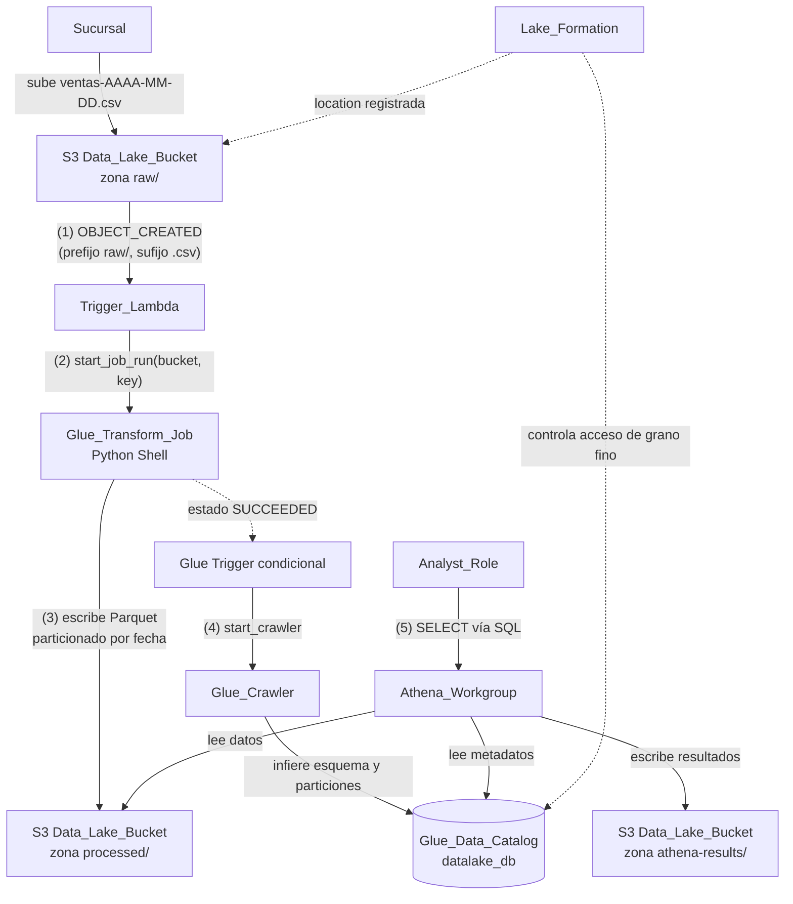

# serverless-datalake-aws

Data Lake **serverless** y educativo en AWS, definido íntegramente con **AWS CDK v2 (Python)**
dentro de un **único stack**: `DataLakeStack`. Se despliega en tu propia cuenta con un solo
`cdk deploy` y se destruye limpio con `cdk destroy`, sin recursos huérfanos.

El proyecto acompaña una serie de blog posts orientada a **data engineers de habla hispana** que
están aprendiendo arquitecturas serverless de datos en AWS. Por eso el código prioriza la
**claridad y la legibilidad** por sobre la optimización prematura.

## Escenario

Las sucursales de una empresa suben sus ventas diarias como archivos CSV. El pipeline las
transforma automáticamente en datos consultables por SQL, sin intervención manual:

1. Una sucursal sube `ventas-2025-06-10.csv` a la zona `raw/` del bucket.
2. El evento dispara el pipeline.
3. Los datos quedan transformados a **Parquet particionado por fecha** y catalogados.
4. Un analista los consulta con **SQL desde Athena**.

El principio rector es **cada servicio hace una sola cosa, conectados por eventos**: el
almacenamiento notifica, una función orquesta, un job transforma, un crawler cataloga y un motor de
consultas expone. Ningún componente conoce los detalles internos del otro; se comunican por eventos
y por convenciones de ubicación en el bucket.

## Arquitectura event-driven

El pipeline no tiene un orquestador central. Se compone de **cinco saltos** desacoplados:

1. **S3 `raw/` notifica** — al crear un `.csv` bajo `raw/`, S3 emite una notificación
   `OBJECT_CREATED` filtrada por prefijo y sufijo.
2. **`Trigger_Lambda` orquesta** — recibe el evento, extrae `bucket`/`key` e inicia el Glue Job
   (`start_job_run`). No transforma datos: solo orquesta.
3. **`Glue_Transform_Job` transforma** — Python Shell que convierte el CSV a Parquet particionado
   por fecha en `processed/` (escritura atómica vía staging).
4. **`Glue Trigger` condicional dispara el `Glue_Crawler`** — cuando el job termina en estado
   `SUCCEEDED`, el crawler cataloga esquema y particiones en la base `datalake_db`.
5. **`Athena_Workgroup` expone por SQL** — un analista consulta las tablas catalogadas.
   **Lake Formation** controla el acceso de grano fino sobre el catálogo.

El filtro de la notificación (prefijo `raw/`, sufijo `.csv`) es **crítico** para evitar loops: las
escrituras del job en `processed/` no coinciden con el filtro y nunca re-disparan la Lambda.



## Prerequisitos

- **Cuenta de AWS** con permisos para crear S3, Lambda, Glue, Athena, IAM y Lake Formation.
- **Credenciales / perfil** de AWS configurados (`aws configure` o variables de entorno). La CLI de
  CDK toma cuenta y región del perfil activo.
- **Python 3.12**.
- **Node.js** y la **AWS CDK CLI v2** (`npm install -g aws-cdk`).
- Dependencias de Python instaladas en un entorno virtual (ver más abajo:
  `pip install -r requirements.txt`).

## Parametrización de cuenta y región

El stack **nunca** contiene valores hardcodeados de cuenta o región. `app.py` resuelve el
environment y se lo inyecta al stack vía el parámetro `env` de CDK, con esta precedencia:

- **Cuenta**: `CDK_DEFAULT_ACCOUNT` (inyectada por la CLI de CDK desde el perfil de AWS activo).
- **Región**, en este orden:
  1. `CDK_DEFAULT_REGION` (del perfil de AWS, vía la CLI de CDK).
  2. Variable de entorno propia `DATALAKE_REGION`.
  3. Contexto de CDK `datalake:defaultRegion` (definido en `cdk.json`, hoy `us-east-1`;
     sobreescribible con `-c datalake:defaultRegion=...`).

Si no se puede determinar la cuenta o la región, la síntesis se aborta con un mensaje que indica
**cuál de los dos valores falta**, sin crear recursos.

## Deploy

```bash
# 1. Crear y activar el entorno virtual
python -m venv .venv && source .venv/bin/activate

# 2. Instalar dependencias
pip install -r requirements.txt

# 3. Bootstrap del entorno (SOLO la primera vez por cuenta/región)
cdk bootstrap

# 4. (Opcional) Revisar el template sintetizado
cdk synth

# 5. Desplegar el stack
cdk deploy
```

Al terminar, `cdk deploy` imprime los cuatro [outputs del stack](#outputs-del-stack) que necesitás
para probar el pipeline.

## Cómo probar el pipeline de punta a punta

1. **Generar un CSV de ventas de ejemplo** con el generador standalone (solo librería estándar, sin
   AWS):

   ```bash
   python sample_data/generate_ventas.py
   # o con parámetros explícitos:
   python sample_data/generate_ventas.py --fecha 2025-06-10 --filas 250 --semilla 7
   ```

   Genera un archivo con la convención de nombre `ventas-AAAA-MM-DD.csv` (la **fecha del nombre**
   es la que determina la partición). Las columnas, en orden, son:
   `fecha`, `sucursal`, `producto`, `cantidad`, `monto`.

2. **Subir el CSV a la zona `raw/ventas/`** del bucket. Usá el nombre real del bucket del output
   `DataLakeBucketName`:

   ```bash
   aws s3 cp ventas-2025-06-10.csv s3://<DataLakeBucketName>/raw/ventas/
   ```

3. **Esperar a que el pipeline corra solo**: la subida dispara la `Trigger_Lambda`, que inicia el
   `Glue_Transform_Job`; al terminar con éxito, el Glue Trigger condicional dispara el
   `Glue_Crawler`, que cataloga las tablas en `datalake_db`. Podés seguir el progreso en la consola
   de Glue (Jobs y Crawlers).

4. **Consultar en Athena**: en la consola de Athena, **seleccioná el workgroup** del output
   `AthenaWorkgroupName` (`datalake_workgroup`) y ejecutá una consulta sobre `datalake_db`:

   ```sql
   SELECT fecha, sucursal, producto, cantidad, monto
   FROM datalake_db.ventas
   LIMIT 20;
   ```

   > El crawler infiere el nombre de la tabla a partir de la ruta en `processed/`. Si difiere,
   > listá las tablas disponibles con `SHOW TABLES IN datalake_db;`.

## Outputs del stack

`cdk deploy` expone exactamente cuatro outputs con los identificadores que vas a necesitar después
del despliegue:

| Output | Qué es | Para qué lo usás |
|--------|--------|------------------|
| `DataLakeBucketName` | Nombre del bucket S3 del data lake. | Subir CSV a `raw/ventas/` y ubicar `processed/`, `curated/` y `athena-results/`. |
| `GlueTransformJobName` | Nombre del Glue Job que transforma CSV a Parquet. | Inspeccionar o re-ejecutar el job manualmente desde la consola/CLI de Glue. |
| `AthenaWorkgroupName` | Nombre del workgroup de Athena (`datalake_workgroup`). | Seleccionarlo en Athena antes de consultar (aplica el límite de bytes y la ubicación de resultados). |
| `DatalakeDbName` | Nombre de la base del Glue Data Catalog (`datalake_db`). | Referenciarla en tus consultas SQL. |

## Costos estimados

Todo el stack es **serverless y de pago por uso**: no hay costos fijos mensuales por tener la
infraestructura desplegada. Los costos se generan solo cuando el pipeline procesa datos o cuando se
consulta:

- **Amazon S3**: almacenamiento de los datos (`raw/`, `processed/`, `athena-results/`) y de los
  assets de CDK. Costo proporcional a los GB almacenados y a las peticiones.
- **AWS Lambda**: facturada por invocación y tiempo de cómputo. El orquestador corre milisegundos
  por archivo subido, por lo que su costo es marginal.
- **AWS Glue (Python Shell)**: facturado por DPU-hora. El job usa entre **~0.0625 y 1 DPU** y corre
  pocos segundos/minutos por archivo. El crawler también se factura por DPU-hora mientras cataloga.
- **Amazon Athena**: se factura por **bytes escaneados** por consulta. El workgroup limita cada
  consulta a **1 GiB** escaneado como protección de costos; consultar Parquet particionado reduce
  los bytes leídos.

> Estos valores son **estimaciones educativas** para dar una idea de magnitud. Consultá siempre la
> **página de precios vigente de AWS** para tu región antes de sacar conclusiones de costo.

## Tests

La suite usa **pytest** y combina tres niveles, **sin desplegar recursos reales**:

- **CDK assertions** (`aws_cdk.assertions.Template`): validan la configuración del template
  sintetizado (cifrado, bloqueo de acceso público, filtro `raw/`, ausencia de `Resource: "*"`,
  outputs, etc.).
- **Property-based tests** con **Hypothesis**: validan la lógica pura (filtrado de la Lambda,
  extracción de fecha, transformación CSV→Parquet, generador de datos y resolución de environment).
- **Unit tests**: cubren ejemplos concretos y casos de error.

```bash
pytest
```

## Cómo destruir el stack

```bash
cdk destroy
```

El proyecto está pensado para destruirse limpio, sin dejar recursos huérfanos:

- El **bucket** tiene `RemovalPolicy.DESTROY` y `auto_delete_objects=True`: se eliminan el bucket y
  todos sus objetos y versiones.
- El **workgroup de Athena** usa `recursive_delete_option=True`: se elimina aunque conserve
  consultas guardadas o historial.

## Estructura del proyecto

```
serverless-datalake-aws/
├── app.py                      # Punto de entrada CDK: resuelve env e instancia DataLakeStack
├── cdk.json                    # Configuración de la app CDK y contexto por defecto
├── datalake/
│   └── datalake_stack.py       # Único stack con toda la infraestructura
├── lambda_src/
│   └── trigger_pipeline.py     # Handler Lambda que inicia el Glue Job
├── glue_src/
│   └── transform_job.py        # Script del Glue Job (CSV -> Parquet)
├── sample_data/
│   └── generate_ventas.py      # Generador standalone de CSV de ventas ficticias
├── tests/                      # CDK assertions + property-based (Hypothesis) + unit
├── requirements.txt
├── .gitignore
├── LICENSE                     # MIT
└── README.md
```

## Seguridad

Seguro por defecto, alineado con los objetivos de diseño:

- **Cifrado en reposo SSE-S3** en el bucket (todo objeto se cifra automáticamente) y **TLS forzado**
  (`enforce_ssl`) para el tráfico en tránsito.
- **Sin acceso público**: el bucket activa las cuatro flags de `BlockPublicAccess`; ninguna política
  o ACL puede abrirlo al público.
- **Roles IAM de mínimo privilegio**: cada servicio (Lambda, Glue Job, Crawler) recibe solo los
  permisos que necesita, con **ARNs concretos** y **sin `Resource: "*"`**. La Lambda solo puede
  iniciar el job exacto; el Glue Job lee `raw/` y escribe `processed/`, sin acceso a `curated/`.
- **Lake Formation** para el acceso de grano fino: el bucket se registra como location y el
  `Analyst_Role` obtiene acceso de datos **solo vía permisos `SELECT`** de Lake Formation, sin
  políticas IAM directas sobre S3.

## Licencia

Distribuido bajo licencia [MIT](LICENSE).
